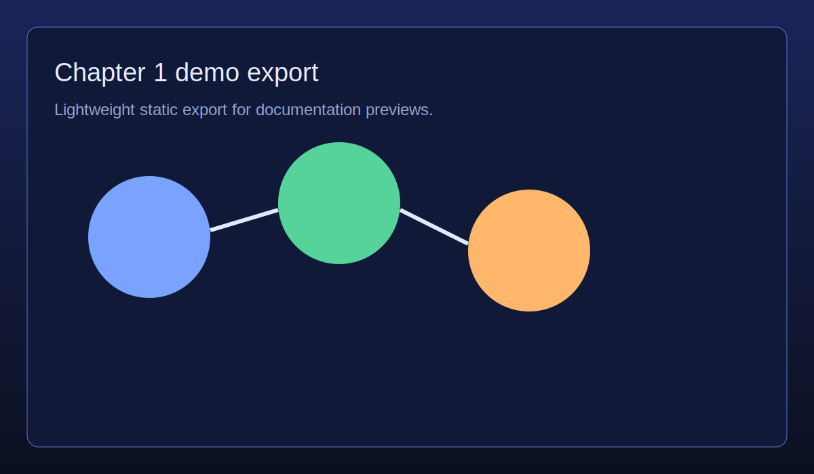

# Chapter 1 — Centrality in Graphs

**Concept → Use case:** Node centrality → Fraud ring detection in payment networks.

- Demo: [`visuals/demos/chapter-1-centrality.html`](../../visuals/demos/chapter-1-centrality.html)
- Screenshot: 
