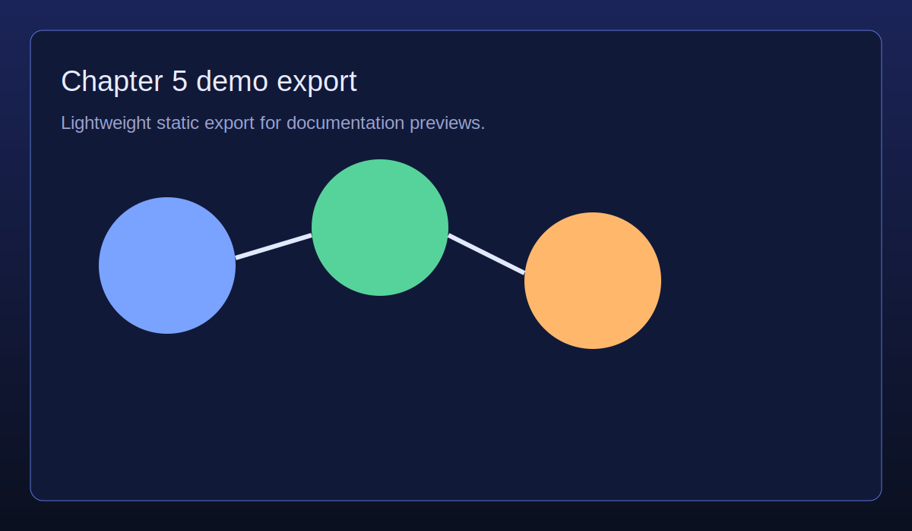

# Chapter 5 — Knowledge Graph Reasoning

**Concept → Use case:** Inference chains in a knowledge graph → Clinical decision support.

- Demo: [`visuals/demos/chapter-5-reasoning.html`](../../visuals/demos/chapter-5-reasoning.html)
- Screenshot: 
